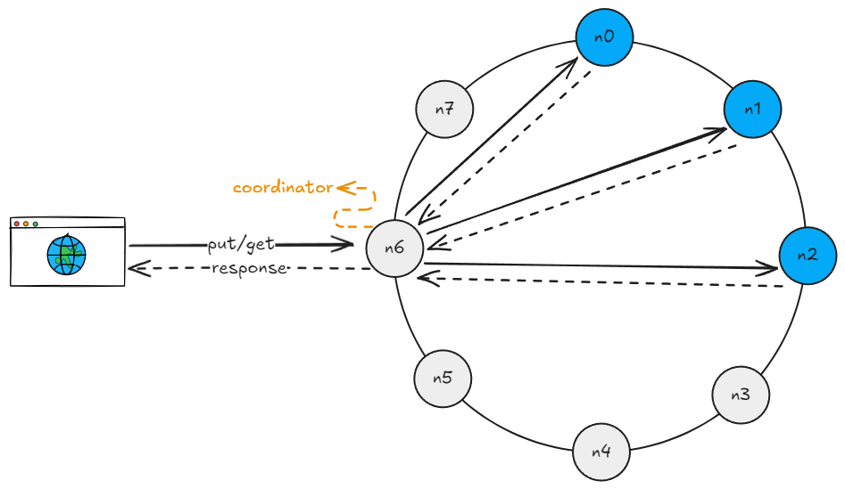

# Key Value Store

## Requirements

### Functional
- [x] Should be able to put data on the storage
- [x] Should be able to retrieve data from the storage

### Non-functional
- [X] The size of a key-value pair is small: less than 10 KB
- [X] Ability to store big data
- [ ] High availability: The system responds quickly, even during failures
- [X] High scalability: The system can be scaled to support large data set
- [ ] Automatic scaling: The addition/deletion of servers should be automatic based on traffic
- [ ] Tunable consistency
- [ ] Low latency

## Architecture

### Compression and consistent hashing
To optimize the memory usage of single store instance, compression can be used.
But this is not enough to store a massive amount of data, to that the data need to be distributed 
through other services. A hash can be used to decide which server the information will be stored 
or retrieved. The downside of this approach is that the hash generation depends on the amount of 
available instances, if this size was increased by adding a new instance or decreased by removing 
the instance or inavailability, the data can be sent to the wrong instance and the system 
can become inconsistent. To address this issue consistent hashing can be used.

<!-- - Virtual nodes

### Inconsistency resolution
- Versioning
- Vector locks (vector clocks)

### Failure detection
- All-to-all multicast
- Gossip protocol

### Temporary failures
- Quorum approach
- Sloppy quorum
- Hinted handoff

### Permanent failures
- Anti-entropy protocol
- Merkle tree
-->