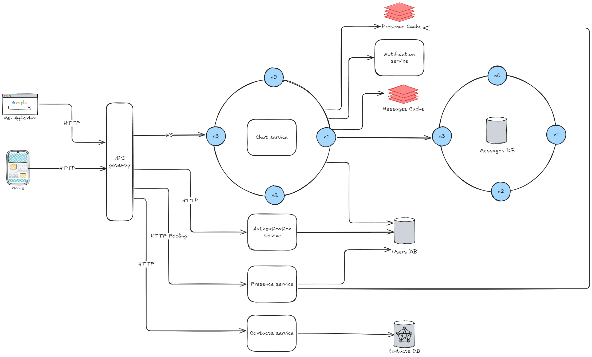

## 📋 Requirements
### Functional
- Should support 1 on 1 chat.
- Should support group chat.
- Should support online indicator.
- Should support multi-device.
### Non-functional
- Low latency

## 🧬 Characteristics
- Should support 50 million daily active users (DAU).
- The chat history should be stored indefinitely.

## 🏗️ High-level design

In order to scale the chat capability, the system was split in four services,
respectively authentication, contacts, chat and presence.
To distribute the requests to the right server instances we can use a API gateway, 
and also take advantage of load balancing and rate limiting.

## 🔍 Deep dive
### Authentication
The first step on the user journey is to authenticate, is this step the user send their login information 
and the service verifies on database if the user exists returning a session token. When the user login we 
also persist the status online on the user database.
### Contacts
The user need to see a list of contacts that is stored on a graph database, so it can call the contacts service.
### Chat
When the user start chatting with a contact it starts a web socket connection with the chat service. 
The service will persist the message on a messages cache and on a database.
If the contact is with the chat open, it should be connected to the same channel as the user and, the service
will send the message directly to the contact. If the contact is offline the chat service will send a push
notification to the contact by calling the notification service. Since our chat service is handles a web socket
connection isn`t trivial to upscale it. To do that we can use consistency hashing and choose the chat id as the 
hash for the server.
### Presence
To check if the user is online, the client can call the presence service from time to time, informing the presence 
if the user stop informing the presence after a while, the presence service will mark the user as offline.

