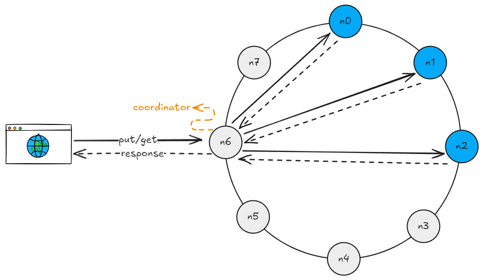
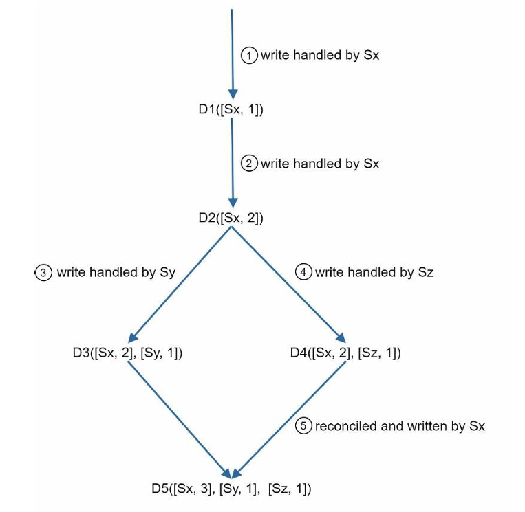
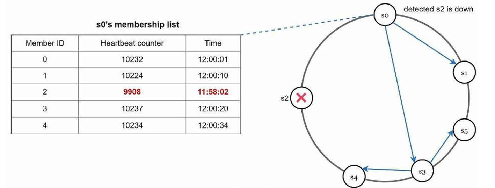
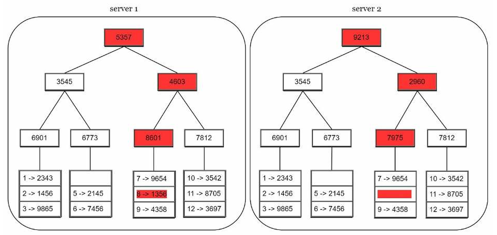

# Key Value Store

## Requirements

### Functional
- [x] Should be able to put data on the storage
- [x] Should be able to retrieve data from the storage

### Non-functional
- [X] The size of a key-value pair is small: less than 10 KB
- [X] Ability to store big data
- [X] High availability: The system responds quickly, even during failures
- [X] High scalability: The system can be scaled to support large data set
- [X] Automatic scaling: The addition/deletion of servers should be automatic based on traffic
- [X] Tunable consistency
- [X] Low latency

## Architecture

### Data compression and consistent hashing
To optimize the memory usage of single store instance, compression can be used.
But this is not enough to store a massive amount of data, to that the data need to be distributed 
through other services. A hash can be used to decide which server the information will be stored 
or retrieved. The downside of this approach is that the hash generation depends on the amount of 
available instances, if this size was increased by adding a new instance or decreased by removing 
the instance or unavailability, the data can be sent to the wrong instance and the system 
can become inconsistent. To address this issue consistent hashing can be used.

### Data replication
Partitioning the data across multiple instances can solve the scalability requirements,
however the system can present unavailability if an instance goes down. In order to
prevent that, the data can be replicated to the next N servers on the ring, where N
is a configurable parameter.

### Quorum consensus
To ensure consistency across the replicas we can use a quorum consensus strategy. 
Basically we can define values for write and read operations and the coordinator need to acknowledge 
the number of servers corresponding to the values.

### Versioning and vector clock
Replicating the data across multiple nodes can increase significantly the availability of the system, 
but it can also lead to inconsistencies. In order to detect and reconcile conflicts we need to treat
every modification as a new immutable version of data and use a lock strategy like vector clock.
Where we store a pair of server and version, along with the data and use this information to make the
inconsistency detection and reconciliation.

### Gossip protocol
To detect failures in a decentralized way we can use methods like the gossip protocol. 
This strategy consists on:
* Maintain a node member list, which contains member's id and heartbeat counters, on each node.
* Each node periodically increments its own heartbeat.
* Each node sends periodically heartbeats to a set of random nodes, which in turn 
propagate to another set of nodes.
* Each node should update the memberlist which the lastest info.
* If the heartbeat value has not increased for more than predefined periods, the member is
considered offline.

### Handling temporary failures
After detecting a failure, we need some strategies to ensure availability.
The strict quorum approach consists on block read and write operations temporarily.
Sloppy quorum select only the healthy predefined value of server for write and read and ignore the offline servers.
Hinted handoff consists on redirecting the request of a server temporarily unavailable to another server 
and them push back the changes when the server was up again.

### Handling permanent failures
To handle permanent failures we need another strategies like anti-entropy protocol. This protocol 
involves comparing each piece of data on replicas and updating each replica to the newest version.
To detect this king of failure we can use a merkle tree. 

