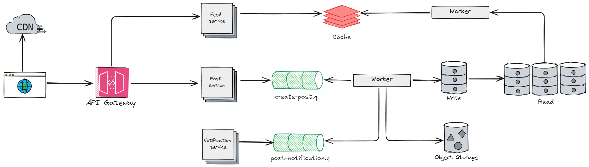

# News feed

## 📋 Requirements

### Functional
- Make posts
- See friends news feed
- Feeds sorted in reverse chronological order

### Non-functional
- High availability
- Should handle a high throughput
- Low latency

## 🏗️ High-level design


For this design the system was split in three services, post, feed and notification.
The post service is responsible to handle the post creation, to handle the high throughput 
we can have multiple replicas along with the use of queries. This service create a message 
on the notification service queue when a new post was created, the text and metadata from the post 
is added to the relational database and the media content to an object storage, that later will be 
uploaded to a CDN. The feed service is responsible to creating and provide the feed for each user.

### Api design
Create a new post:
```http
POST /v1/me/feed
```
Get posts:
```http
GET /v1/me/feed
```
