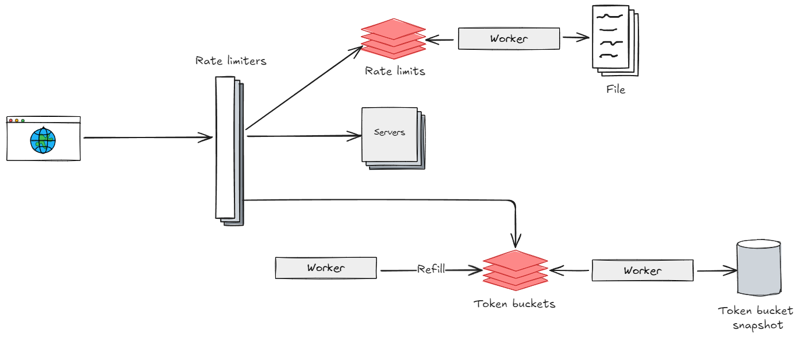
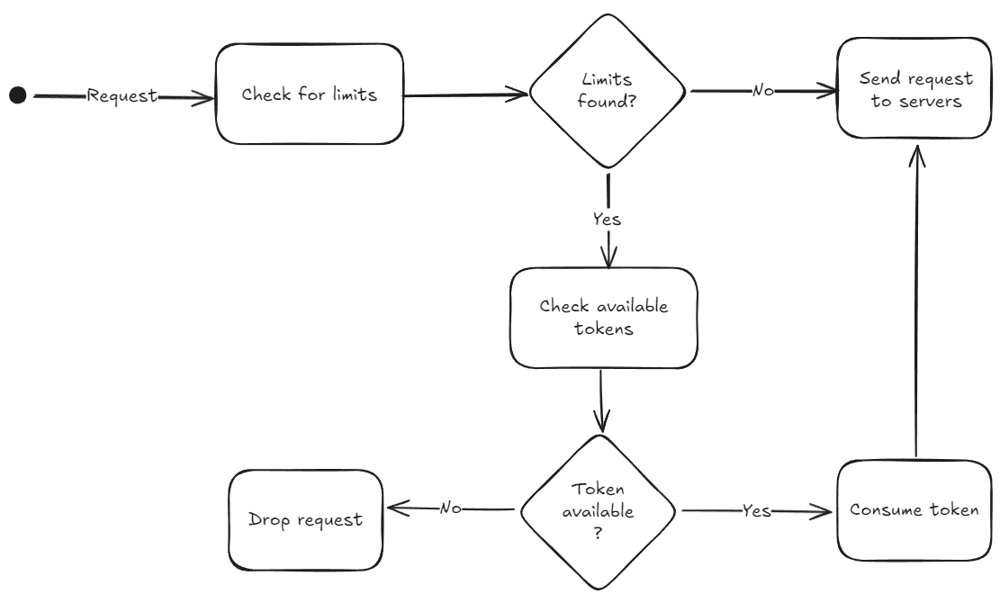
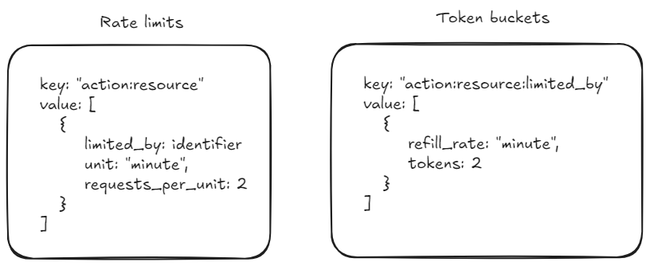

# Rate Limiter

## Context
A rate limiter is a component that limits the number of user's requests allowed over a period of time.
The advantages of this service is to prevent resource starvation in case of a DoS (Denial of Service) attack, 
reducing costs by limiting the number of calls to a thirty-party api and prevent servers overload.

## Requirements

### Functional
- [X] Accurately limit excessive requests
- [X] Distributed rate limiting
- [X] Error handling

### Non-functional
- [X] Low latency. Should not slow down HTTP response time
- [X] Use as little memory as possible
- [X] High fault tolerance

## Architecture

The rate limiter should gather user id or ip address information of the requests and them apply
a restriction based on some limits. The limits could be stored in a file by using services like S3
or a database, and this information could be cached and refreshed from time to time by a worker.

### File structure
The file structure could look like this:
```yml
- action: create #create, read, update, delete
  resource: posts
  rate_limit:
    limited_by: identifier #identifier, ip_address
    unit: minute #second, minute, hour, day
    requests_per_unit: 2
```
In this example the action and resource represents where the limits will be applied.
Inside the rate_limit attribute, there is limited_by which identifies fi the limit will
by applied by id, ip or another property, the unit sets the window time and
requests_per_unit sets the maximum allowed value on this window size.
In this file it's being defined that each user can create only 2 posts by minute.

### Token bucket
To handle the limit validation in a memory efficient way, token bucket algorithm can be used.
The rate limiter could validate if there are limits configured for a specific resource
and action, then validate for each time window bucket, if there is token available,
if it's true, the tokens will be consumed and the request will be move forward, otherwise
the request will be rejected with a 429 HTTP response (Too many requests).



The tokens can be refilled through a worker that runs for each time window. For instance
each second, minute, hour or once a day.

### Storage
To achieve the latency requirements could be used a memory database, nevertheless
it could be a problem for long widow sizes, for instance a dairy limit, because the
storage can crash and the data could be lost. To mitigate that could be added a NoSQL
database to store a snapshot of the values in memory, from time to time.

For the memory storage a key-value storage could be used with the following schemas:



### Race condition
Concurrent rate limiters can present race condition issues, to prevent that could be
used Lua script to ensure atomicity.