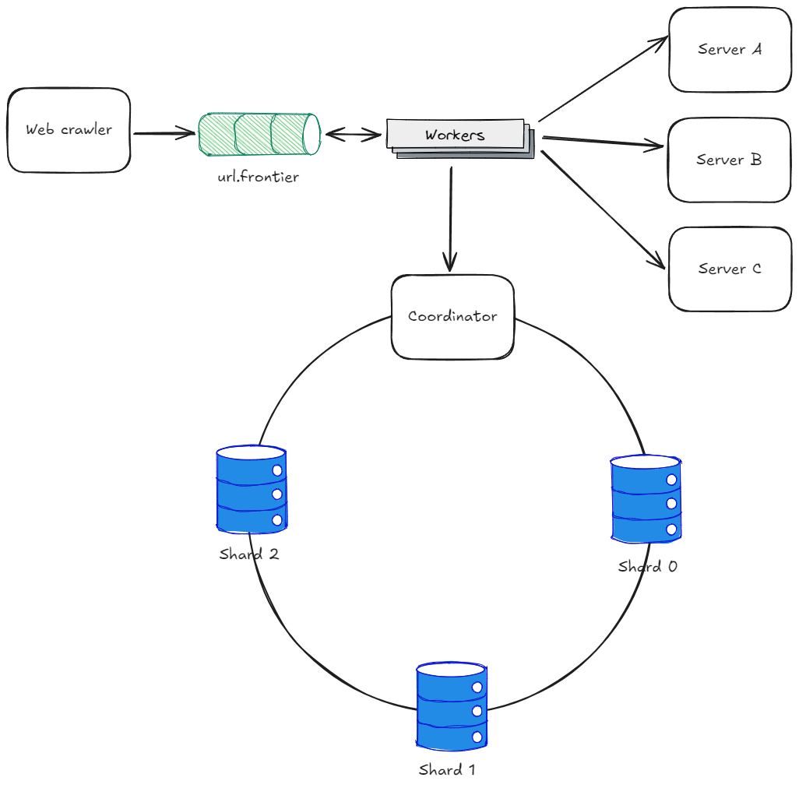

# Web crawler
## 📋 Requirements
### Functional
- Should download all the web pages addressed by the URL list
- Should extract URLs from these pages
- Should add to the list of URLs to be downloaded
- Should consider newly added or edited web pages
- Duplicated content should be ignored
### Non functional
- Should be able to handle 1 billion pages per month
- Need to store HTML pages up to 5 years
- High scalable
- Robustness
- Politeness
- Extensibility

## 🏗️ High-level design
### Back of the envelope

### Design

The web crawling starts by adding a list of URL's (seeds) to the queue url.frontier, this queue will be consumed by multiple workers that will download the HTML from the pages, check if the content already exists on the content storage, extract the links, apply filters, check if the link was already seen on the URL storage and add the new links to the url.frontier. The crawler algorithm can be implemented with BFS (Breadth First Search).

## 🔍 Deep dive
### Freshness
To consider newly added or edited web pages, we can recrawl from time to time, based on web page's update history and prioritize URLs, by recrawling important pages first and more frequently.
### Robustness
To ensure robustness we can take advantage of techniques like consistent hashing to add new serves and scale the database, save crawl states and data to recovery in case of failure, along with robust exception handling and data validation. We also must apply filters by avoid spider traps.
### Politeness
To avoid sending too many requests and possibly be treat like a DOS attack, we can add a delay between the requests.
### Extensibility
The web crawler should be implemented in using an modular architecture, that allows easy adding new modules, to process other types of contents. To do that follow the SOLID principles like Open-Closed, Liskov Substitution and Open Closed will be crucial. We can take advantage of patterns like strategy also.
