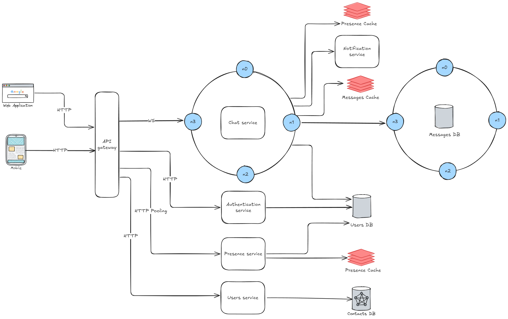

# Chat system
## Requirements
### Functional
- [x] Should support 1 on 1 chat.
- [x] Should support group chat.
- [x] Should support online indicator.
- [x] Should support multi-device.
### Non-functional
- [x] Should support 50 million daily active users (DAU).
- [x] The chat history should be stored indefinitely.
- [x] Low latency
## Architecture

In order to scale the chat capability, the system was split in four services,
respectively authentication, contacts, chat and presence.
To distribute the requests to the right server instances we can use a API gateway, 
and also take advantage of load balancing and rate limiting.
### Contacts
### Authentication
### Presence
### Chat
