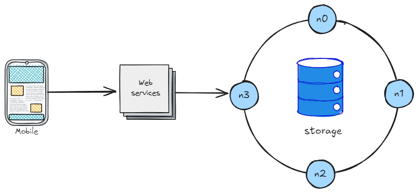

# 🏃 Fitness Tracking App

## 📋 Requirements

### Functional
- Mobile-first (iOS & Android)
- Track steps, calories, heart rate, and workout types (running, cycling, etc.)
- GPS-based location tracking for runs
- Sync data to the cloud for multi-device access
- Offline support (data stored locally and synced later)
- User profiles (support multiple users per device)

### Non-functional
- High availability for user data
- Scalability to millions of daily users
- Secure data handling (authentication + privacy)
- Efficient battery and network usage
- Low latency in syncing and retrieving fitness data

---

## 🧬 Characteristics
- Target scale: ~10 million daily active users
- Users generate frequent updates (step counts, heart rate, workout logs)
- Data retention for historical activity tracking
- Requires global availability

---

## 🏗️ High-level Design

1. **Mobile App**
    - Collects data from sensors (accelerometer, GPS, heart rate monitor).
    - Stores data locally for offline use.
    - Syncs in batches to backend via API.

2. **Backend Services**
    - API Gateway for mobile clients.
    - Authentication & authorization service (token-based).
    - Data ingestion service for batching uploads.
    - Workout service for managing user activity and history.

3. **Storage Layer**
    - Relational DB for user profiles & metadata.
    - Time-series DB or partitioned relational tables for sensor data.
    - Object storage for GPS maps & media (images/videos of workouts).

4. **Scalability**
    - Sharding by user ID.
    - Load balancers for stateless services.
    - CDN for static assets (maps, media).

5. **APIs** (examples)
    - `POST /workouts` → Upload workout data in batches
    - `GET /workouts?userId={id}&metric=steps` → Retrieve history
    - `POST /auth/login` → Authenticate users

---

## 🔍 Deep dive

### Offline Sync & Conflict Resolution
- Each data point is timestamped on device.
- On reconnect, client uploads missing records.
- Backend reconciles using **latest timestamp wins** policy.
- Optionally, merge strategies for metrics (e.g., cumulative steps).

### Database Partitioning
- Shard by user ID to distribute load evenly.
- Consistent hashing ensures even distribution while supporting resharding.
- Secondary indexes for queries by date, activity type, or location.

### Batching & Network Efficiency
- App batches sensor readings before upload to reduce API calls.
- Compression applied to large GPS data payloads.
- Background sync jobs scheduled to avoid draining battery.
