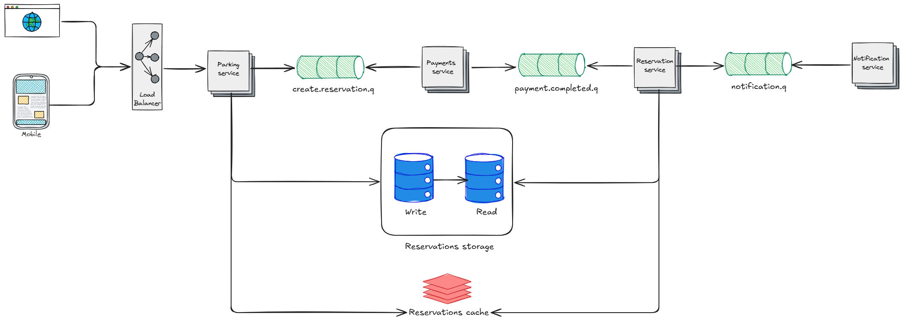

# Parking lot system
[⬅️ Go back](../..)

## 📋 Requirements
### Functional
- Multi-platform
- User's should be able to find available parking spots
- User's should be able to book a spot in advance
- User's should be able to schedule or reserve a parking space ahead of time
### Non-functional
- High availability
- Scalability
## 🧬 Characteristics
- 1 million monthly active users
## 🏗️ High-level design
First, a user need to check if there is a spot available. 
To do that, we can add a parking service and a database.
In this first design, the user send a request for the server and the server will check on the database if there are spots available. 
This service handles the scheduling and payments. 
This initial design isn't scalable, and we can improve a lot.
In this design we have availability problems, because our server and database is a single point of failure. 
In this away, the service can be break into two components, parking and payment. 
The parking service, calls the payment service and if the payment was approved, the user can reserve a slot.
To improve the database, we could add read and write replicas to ensure availability.
## 🔍 Deep dive
### How to avoid double booking?
For this design double booking can be a problem. 
While a user is paying for a slot another user could reserve it. 
To prevent that we can have a status on the database that allow users to temporarily reserve the spot while the sistem is waiting fot the payment confirmation. 
If everything is fine, we can go to the database make a real reservation. 
If something went wrong with the payment, we can just release the spot for another user. 

### Asynchronicity
For the services communication's we can add queues and publish create reservation, payment and notification events.
Making the system more robust, allowing failure handling and independent services scalability.
The parking service publish send a message to the create.reservation queue, th payment read from this queue and process 
the payment. When the processing is done, it publishers on the payment.completed queue, that is consumed by the reservation service.
The reservation service will update the database and the cache making the reservation and publish a message on the notification queue, for the notification service to handle.

