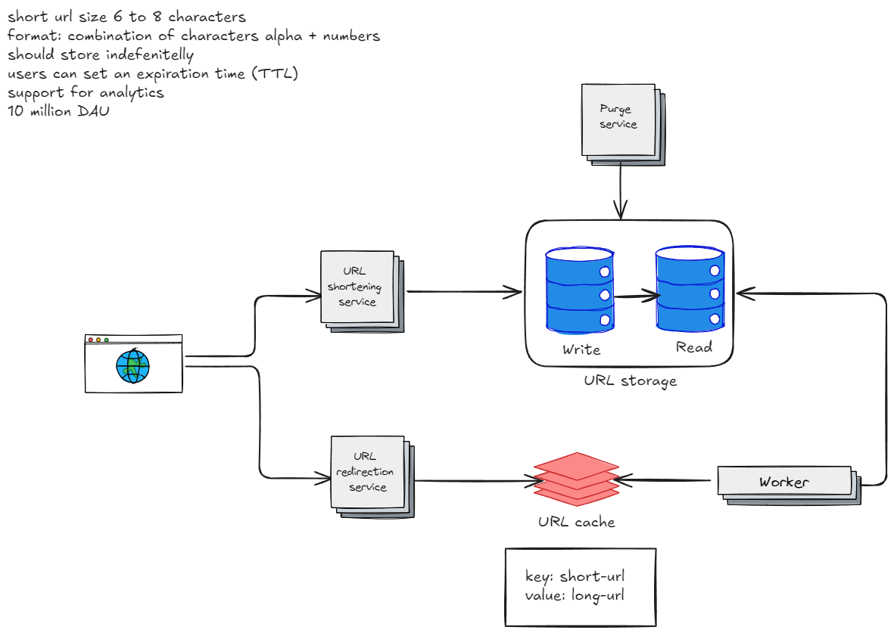

# URL shortening service
[⬅️ Go back](../..)

## Requirements
### Functional
- Users should be able to create new URLs
- Users should be redirected to the right URL when accessing the short one
- URLs can have an expiration date
- Analytics support
### Non-functional
- High availability
- Scalability
- Data should store indefinitely unless there was an expiration date

## Characteristics
- Short should have from 6 to 8 characters being a combination of characters alphanumeric and decimals
- The system should handle 10 million DAU

## High-level design
The system was divided into shortening and redirection services, for independent scale. 
Adding multiple instances of those services, enables scalability and availability. 
Also creating read and write replicas for the database and considering sharding. 
A cache layer can be included to improve the throughput.

## Deep dive
### How to ensure uniqueness and avoid collisions when generating short codes — especially at scale with 10M daily active users?
- Generating sequential IDs 
  - The problem with this approach is generate unique IDs in a distributed systems.
  - I could need a service for generations these IDs, but this could add latency and be a single point of failure
- Using a hash
  - Hash functions could lead to collisions, so check in the database if there is a collision and generate a new hash is needed
  - This approach can add latency
- Base62 conversion
  - This approach is simple, but have security concerns, because the original URL can be easy discovered
- Hybrid approach
  - This approach consists into use a base62 plus a sequential distributed id like Snowflake or TSID
### How to design a cache layer to handle high-throughput redirection requests while minimizing latency and avoiding stale data?
- For cache expiration, TTL could set based on the expiration date. 
- The data could be fetched from the database if there is a cache miss or unavailability.
- A worker can choose which data should be on the cache, all the new URLs or just the more popular one.

### How would your worker decide which URLs to preload into the cache?
Instead of a worker, a service that reads from an analytics database can be added to take the decision based on the analytics.

